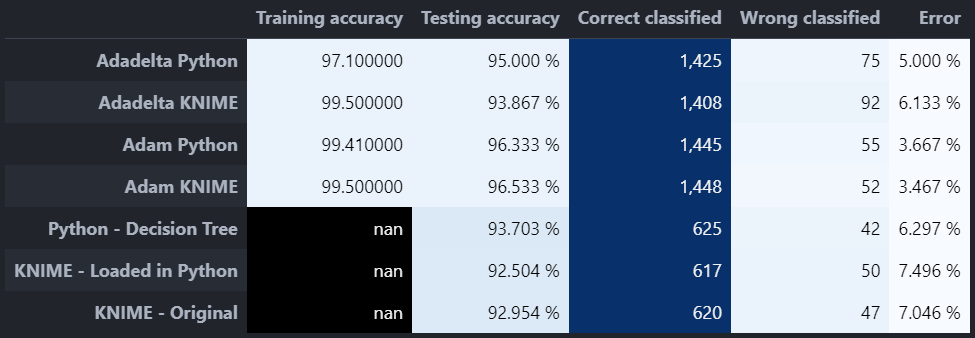

# Python VS KNIME

## Summary

A GitHub repository to show comparison between models exported from KNIME and Python. Python provides the flexibility, while KNIME provides the simplicity with its codeless system.

Things to compare:
1. Train deep learning models using Keras in Python and export to KNIME.
2. Load the deep learning models exported from KNIME to evaluate the results in Python.
3. Repeat steps 1-2 for a conventional machine learning model (e.g. Decision Tree)
4. Compare the evaluation results done in Python and KNIME.
5. Export the Python models to test it in KNIME too.

NOTE: The models should have exactly the same parameters if possible for the best results.

There are two notebooks: `Decision Tree Comparison.ipynb` for comparing Decision Tree models, and `MNIST Digit Classification.ipynb` for comparing CNN models trained in Keras in both KNIME and Python.

## Installation
TensorFlow library for loading and training of deep learning models. Refer to the YouTube video [here](https://youtu.be/hHWkvEcDBO0) for detailed instructions to install TensorFlow with GPU support.

Using `sklearn-pmml-model` library from [here](https://github.com/iamDecode/sklearn-pmml-model), to load PMML model.
Follow the installation steps explained in that GitHub repo.

Using `sklearn2pmml` library from [here](https://github.com/jpmml/sklearn2pmml) to create PMML model.

## Comparison Results

You may refer to the `results` folder for each of the individual confusion matrix for different models.

## Notes on Deep Learning Models
- The MNIST images obtained from KNIME are named differently than usual, i.e. `Row0.png, Row1.png, ... , Row9999.png`. Be careful that sorting the filenames by using only the vanilla `sorted` function (without using a custom sorting method with the `key` argument) would result in an incorrect order of the images when compared to their corresponding labels.
- When comparing deep learning models, be careful that the **default parameters/config in KNIME could be different** from Python, such as in the case of Adadelta optimizer: the default learning rate in Python is 0.001, but 1.0 in KNIME. 
- The training and evaluation results for Adadelta were noticeably different (about 2-3%) between KNIME and Python for some unknown reasons, most likely because of **different Keras version** used in the backend of KNIME.
- The exported deep learning models from KNIME can only be either the **`SavedModel`** format, or the **Keras `.h5` format**. The **`h5`** format can retain all the functionalities associated with the `Keras` framework, such as being able to check all the layers by calling `model.summary()` method. While the `SavedModel` format will have limited functionalities and you would need to extract the model function from the `model.signatures['serve']` key to be able to run inference. Please refer to the last two sections of the `MNIST Digit Classification.ipynb` notebook for the detailed steps.

## Notes on Machine Learning Models in PMML format
- You must install the `sklearn-pmml-model` library from [here](https://github.com/iamDecode/sklearn-pmml-model), to load PMML model.
- You must also install the `sklearn2pmml` library from [here](https://github.com/jpmml/sklearn2pmml) to convert from `sklearn` pipeline to a PMML model.
- Both of these libraries are the best solutions that I have found for now, things might change and you might need to find other alternatives in the future.
- For the detailed steps of how to load and export PMML model, please refer to the `Decision Tree Comparison.ipynb` notebook.
- Be careful that KNIME might use different model parameters/implementations from `sklearn` models and many parameters cannot be changed easily in `sklearn` to follow the parameters used by KNIME.
- The `Decision Tree Learner` application used in KNIME also automatically encodes the nominal/categorical columns and I couldn't find any reference on how exactly they encode them. Therefore, in the experiment done in this repo, I used `OrdinalEncoder` to encode the columns before I use the KNIME's Decision Tree Model to make inference, but the performance result was slightly different.
- On the other hand, the Decision Tree model that I trained in Python has to drop the categorical columns in order to achieve similar performance as the KNIME's model.